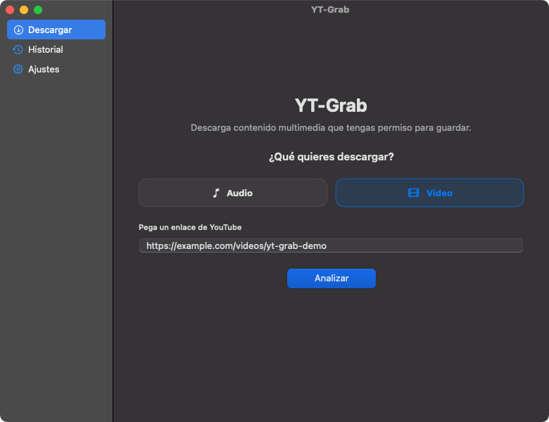
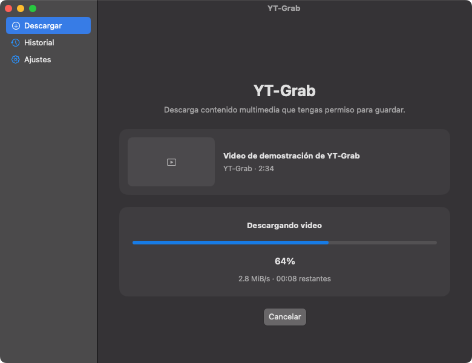
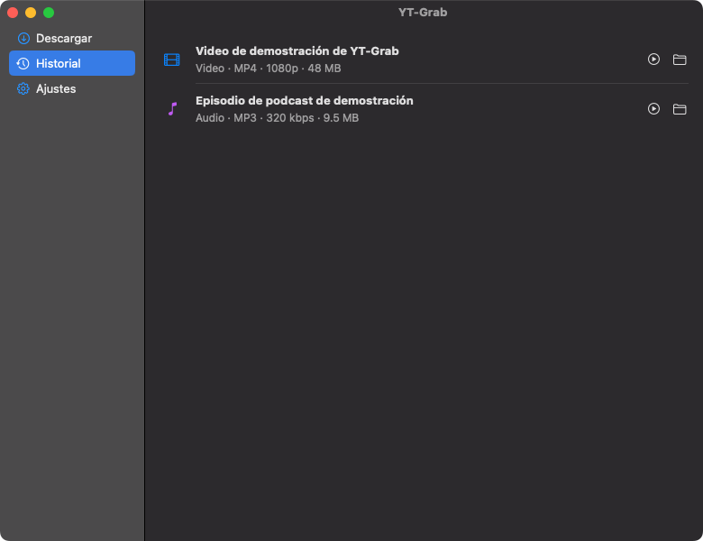

<p align="center">
  
</p>

<p align="center">
  Una utilidad nativa para macOS que descarga audio y video autorizado mediante yt-dlp y FFmpeg.
</p>

<p align="center">
  <strong>Español</strong> · <a href="README.md">English</a>
</p>

<p align="center">
  <a href="https://github.com/itcaso/YT-Grab/releases/latest/download/YT-Grab-macOS-universal.dmg"><strong>Descargar YT-Grab para macOS (.dmg)</strong></a>
  ·
  <a href="https://github.com/itcaso/YT-Grab/releases/latest/download/YT-Grab-macOS-universal.zip">Versión ZIP</a>
  ·
  <a href="https://github.com/itcaso/YT-Grab/archive/refs/heads/main.zip">Descargar código fuente</a>
</p>

## Descargar e instalar

Los usuarios comunes **no necesitan** Swift, Xcode ni herramientas de programación.

1. Descarga la última [imagen de disco de YT-Grab](https://github.com/itcaso/YT-Grab/releases/latest/download/YT-Grab-macOS-universal.dmg). También está disponible una [versión ZIP](https://github.com/itcaso/YT-Grab/releases/latest/download/YT-Grab-macOS-universal.zip).
2. Abre el DMG y arrastra `YT-Grab.app` al acceso directo de Aplicaciones.
3. Abre YT-Grab y entra en **Ajustes → Dependencias**. La app puede instalar y verificar yt-dlp automáticamente; si falta FFmpeg, sigue las instrucciones incluidas.

La versión publicada es universal y funciona en Macs Intel y Apple Silicon con macOS 13 o posterior. Los builds públicos están firmados localmente, pero todavía no están notarizados por Apple. La primera vez, macOS podría indicar que el desarrollador es desconocido: haz Control-clic sobre `YT-Grab.app`, selecciona **Abrir** y confirma **Abrir**. También puedes autorizarla en **Configuración del Sistema → Privacidad y seguridad**.

## Funciones

- Interfaz nativa para macOS construida con Swift y SwiftUI.
- Descargas de audio en MP3 o M4A.
- Descargas de video MP4 con audio y unión automática mediante FFmpeg.
- Calidades basadas únicamente en los formatos disponibles en el contenido analizado.
- El enlace de video y la calidad seleccionada se validan nuevamente justo antes de descargar.
- Barra de progreso animada con porcentaje, velocidad y tiempo restante.
- Progreso, cancelación, historial, destino configurable e integración con Finder.
- Selector de destino disponible justo antes de iniciar cada descarga.
- Diagnóstico de dependencias, instalación automática verificada del ejecutable oficial de yt-dlp y guía para instalar FFmpeg.
- Interfaz automática en español o inglés según el idioma configurado en macOS.
- Procesamiento local. Las URL se pasan a `Process` como argumentos y nunca se concatenan en comandos shell.

## Capturas de pantalla

### Insertar un enlace de video



### Progreso de la descarga



### Historial de descargas



## Requisitos para usuarios

- macOS 13 o posterior
- [yt-dlp](https://github.com/yt-dlp/yt-dlp)
- [FFmpeg](https://ffmpeg.org/)

Instala las dependencias mediante Homebrew:

```sh
brew install yt-dlp ffmpeg
```

También puedes abrir **Ajustes → Dependencias**. YT-Grab puede descargar el ejecutable universal oficial `yt-dlp_macos`, verificarlo con la suma SHA-256 de la versión e instalarlo en `~/.local/bin`. Para FFmpeg, la app incluye el enlace oficial y un botón que copia el comando de Homebrew. YT-Grab busca tanto en `~/.local/bin` como en `/usr/local/bin` y proporciona directamente a yt-dlp la ruta detectada de FFmpeg, incluso cuando se abre desde Finder.

## Compilar desde el código fuente

Los desarrolladores y colaboradores necesitan Git y Swift 6, incluido en Xcode 16 o en unas herramientas de línea de comandos de Xcode compatibles. Confirma el compilador instalado con `swift --version`.

```sh
git clone https://github.com/itcaso/YT-Grab.git
cd YT-Grab
swift test -j 2
./Scripts/build-app.sh
```

La aplicación con firma local se genera en `build/YT-Grab.app`. Para crear un paquete universal compatible con Intel y Apple Silicon, usa:

```sh
YT_GRAB_UNIVERSAL=1 ./Scripts/build-app.sh
./Scripts/package-dmg.sh
```

Para contribuir, lee [CONTRIBUTING.md](CONTRIBUTING.md), crea una rama enfocada, ejecuta las pruebas y abre un pull request. GitHub también genera un ZIP del código fuente en cada publicación; el [archivo directo de la rama principal](https://github.com/itcaso/YT-Grab/archive/refs/heads/main.zip) está disponible en todo momento.

## Uso responsable

Descarga únicamente contenido propio o para el que tengas autorización. Es responsabilidad del usuario cumplir la legislación de derechos de autor y los términos de la plataforma de origen.

## Licencia

YT-Grab se publica con código fuente disponible bajo la [PolyForm Noncommercial License 1.0.0](LICENSE.md). Se permiten los usos personales y otros usos no comerciales conforme a sus términos; no se concede uso comercial.

Esta es una licencia de código fuente disponible para uso no comercial, no una licencia open source aprobada por la OSI.

## Créditos

Desarrollado por **Italo McFly (itcaso)**

- [Telegram](https://t.me/itcaso)
- [X](https://x.com/itcaso)
