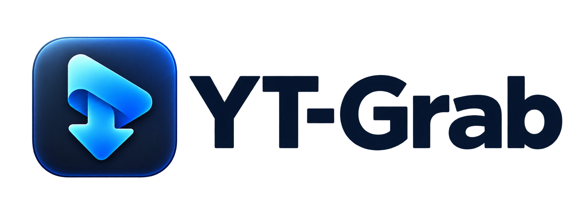
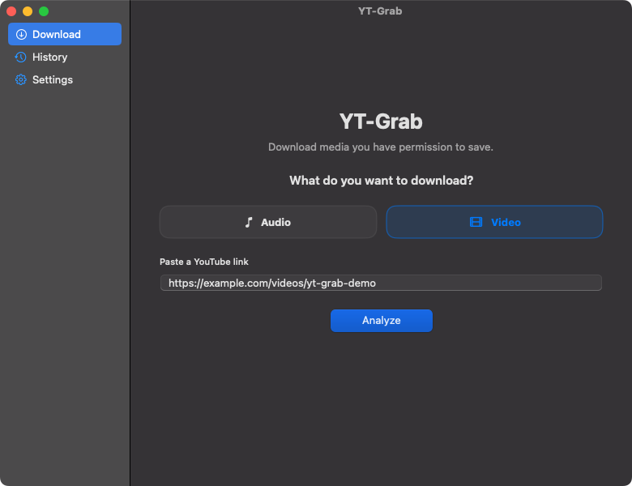
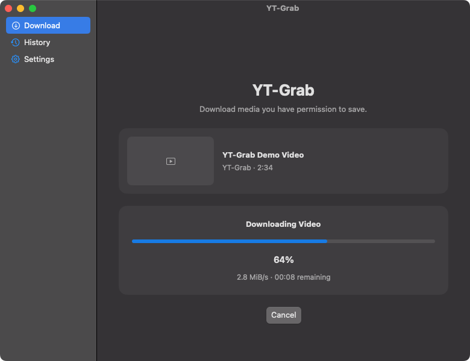
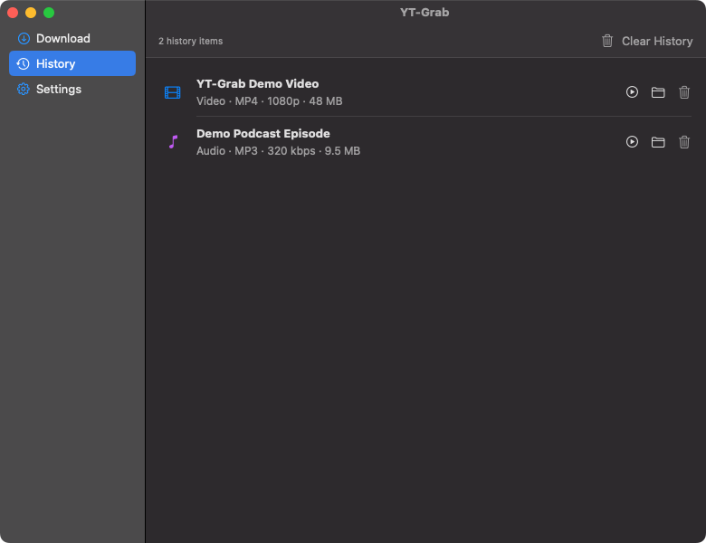

<p align="center">
  
</p>

<p align="center">
  A native macOS utility for downloading authorized audio and video with yt-dlp and FFmpeg.
</p>

<p align="center">
  <a href="README.es.md">Español</a> · <strong>English</strong>
</p>

<p align="center">
  <a href="https://github.com/itcaso/YT-Grab/releases/latest/download/YT-Grab-macOS-universal.dmg"><strong>Download YT-Grab for macOS (.dmg)</strong></a>
  ·
  <a href="https://github.com/itcaso/YT-Grab/releases/latest/download/YT-Grab-macOS-universal.zip">ZIP version</a>
  ·
  <a href="https://github.com/itcaso/YT-Grab/archive/refs/heads/main.zip">Download source code</a>
</p>

## Download and install

Regular users do **not** need Swift, Xcode, or any programming tools.

1. Download the latest [YT-Grab disk image](https://github.com/itcaso/YT-Grab/releases/latest/download/YT-Grab-macOS-universal.dmg). A [ZIP version](https://github.com/itcaso/YT-Grab/releases/latest/download/YT-Grab-macOS-universal.zip) is also available.
2. Open the DMG and drag `YT-Grab.app` onto the Applications shortcut.
3. Open YT-Grab and go to **Settings → Dependencies**. The app can install and verify yt-dlp automatically; follow the included FFmpeg instructions if FFmpeg is missing.

The release is universal and supports Intel and Apple Silicon Macs running macOS 13 or later. Public builds are signed locally but are not yet notarized by Apple. On first launch, macOS may identify the developer as unknown: Control-click `YT-Grab.app`, choose **Open**, then confirm **Open**. You can also allow it from **System Settings → Privacy & Security**.

## Features

- Native Swift and SwiftUI interface for macOS.
- Audio downloads in MP3 or M4A.
- MP4 video downloads with audio and automatic FFmpeg merging.
- Quality options based only on formats available in the analyzed media.
- Video links and the selected quality are validated again immediately before downloading.
- Animated download progress bar with a live percentage, speed and remaining time.
- Progress, cancellation, configurable destination and Finder integration.
- Remove individual history entries or clear the entire history without deleting downloaded files.
- A destination picker is available immediately before each download.
- Dependency diagnostics, verified automatic installation of the official yt-dlp macOS executable, and guided FFmpeg installation.
- Automatic English or Spanish interface based on the macOS language preference.
- Local processing. User URLs are passed to `Process` as arguments and are never interpolated into shell commands.

## Screenshots

### Paste a video link



### Download progress



### Download history



## Requirements for users

- macOS 13 or later
- [yt-dlp](https://github.com/yt-dlp/yt-dlp)
- [FFmpeg](https://ffmpeg.org/)

Install the runtime dependencies with Homebrew:

```sh
brew install yt-dlp ffmpeg
```

You can also open **Settings → Dependencies**. YT-Grab can download the official universal `yt-dlp_macos` executable, verify it against the release SHA-256 checksum, and install it in `~/.local/bin`. For FFmpeg, the app provides its official download page and a copyable Homebrew command. YT-Grab searches both `~/.local/bin` and `/usr/local/bin` and passes the detected FFmpeg path directly to yt-dlp, including when launched from Finder.

## Build from source

Developers and contributors need Git plus Swift 6, supplied by Xcode 16 or compatible Xcode Command Line Tools. Confirm the installed compiler with `swift --version`.

```sh
git clone https://github.com/itcaso/YT-Grab.git
cd YT-Grab
swift test -j 2
./Scripts/build-app.sh
```

The locally signed application is created at `build/YT-Grab.app`. To build a universal Intel and Apple Silicon package, use:

```sh
YT_GRAB_UNIVERSAL=1 ./Scripts/build-app.sh
./Scripts/package-dmg.sh
```

To contribute, read [CONTRIBUTING.md](CONTRIBUTING.md), create a focused branch, run the tests and open a pull request. GitHub automatically provides a source-code ZIP on every release; the [main branch source archive](https://github.com/itcaso/YT-Grab/archive/refs/heads/main.zip) is also available directly.

## Responsible use

Only download media you own or have permission to download. You are responsible for complying with copyright law and the source platform's terms.

## License

YT-Grab is source-available under the [PolyForm Noncommercial License 1.0.0](LICENSE.md). Personal and other noncommercial uses are permitted under its terms; commercial use is not granted.

This is a noncommercial source-available license, not an OSI-approved open-source license.

## Credits

Developed by **Italo McFly (itcaso)**

- [Telegram](https://t.me/itcaso)
- [X](https://x.com/itcaso)
